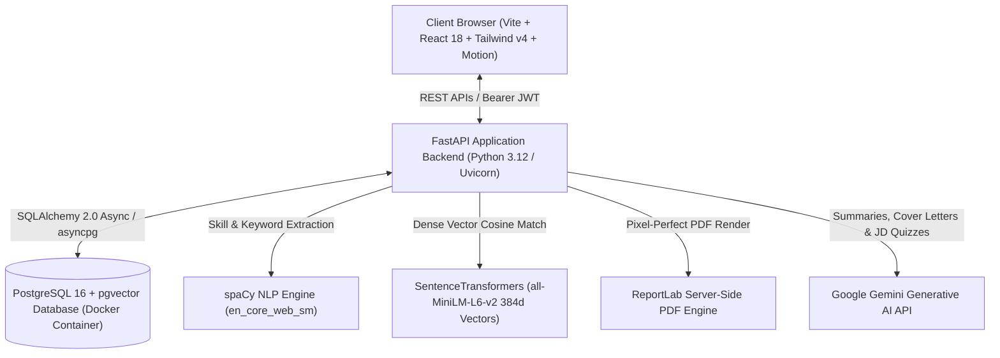
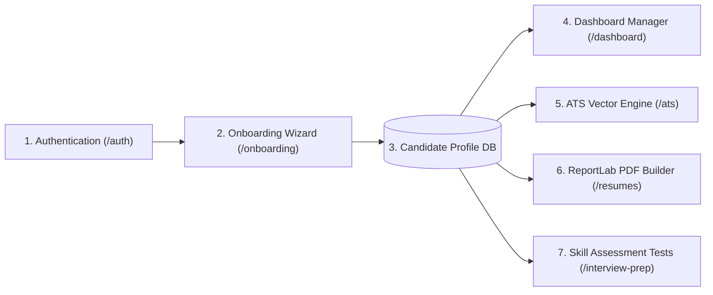
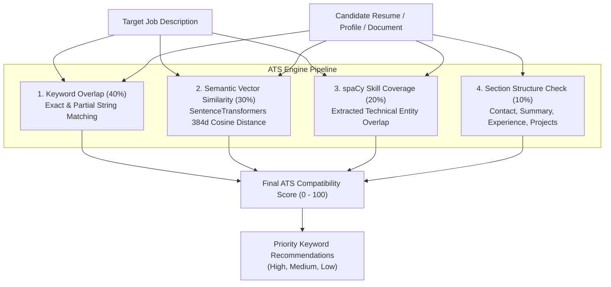
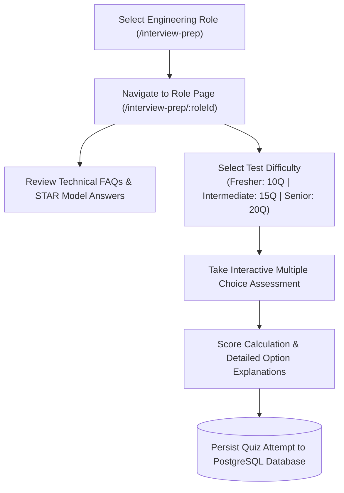
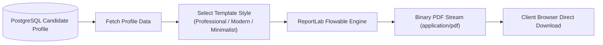

# System Architecture, Flow Diagrams & Operational Guide

This document provides a comprehensive overview of how the **AI Career Engine & Resume Optimization Platform** works, including architectural flow diagrams, data pipelines, module interactions, and execution flows.

---

## High-Level System Architecture

The application is built on a decoupled full-stack architecture combining a single-page React frontend, asynchronous FastAPI backend services, local NLP vector engines, and a PostgreSQL database with `pgvector` extension.



---

## Candidate Journey & Execution Flow



### Step 1: Candidate Authentication & Authorization
1. Candidates register or log in on `/auth`.
2. FastAPI hashes passwords using bcrypt and issues signed JWT access tokens with configurable expiration (`ACCESS_TOKEN_EXPIRE_MINUTES`).
3. Frontend stores the token in Zustand state (`frontend/src/store/useStore.ts`).
4. Protected routes (`ProtectedRoute`) enforce authentication across all candidate application pages.

### Step 2: Profile Onboarding & Persistence
1. Newly registered candidates are automatically routed to `/onboarding`.
2. The multi-step wizard collects Personal Info, Work Experience, Education (with native month pickers), Technical Projects, Technical Skills, and Certifications.
3. Upon completion, data is submitted to `POST /api/profile/onboard` and stored atomically in PostgreSQL.

### Step 3: Candidate Dashboard & Profile Editing
1. Candidates can update any section of their profile directly on `/dashboard`.
2. Date inputs use HTML5 month pickers (`type="month"`) for precise start and graduation/end dates.
3. Profile skills are automatically categorized into Languages, Frameworks, Databases, Tools, Cloud & DevOps, and AI/ML.

---

## 4-Part Deterministic ATS Compatibility Engine Pipeline

The ATS engine evaluates a candidate's resume or profile against a target job description through a transparent, 4-part scoring algorithm:



### ATS Input Modes
1. **Document File Upload**: Accepts PDF (`pypdf`), DOCX (`python-docx`), or TXT files.
2. **Raw Text Dump**: Paste raw resume text directly into the evaluation editor.
3. **Database Candidate Profile**: Evaluates stored PostgreSQL candidate profile data.

---

## Technical Interview & Skill Assessment Pipeline



### Operational Steps for Interview Prep
1. **Role Exploration**: Candidates select from 8 software engineering roles (Full Stack AI, Backend Python, Frontend React, DevOps AWS, Data Science ML, Java Spring Boot, Mobile App, Cybersecurity).
2. **Dynamic Deep-Linking**: Navigates to `/interview-prep/:roleId` with clean URL routing.
3. **STAR FAQs Review**: Candidates read top technical questions paired with Situation, Task, Action, Result (STAR) model answers.
4. **Interactive Skill Tests**: Candidates take multiple choice tests with smooth Framer Motion `layoutId` difficulty tab transitions.
5. **Database Attempt History**: Test results (score, total, percentage, answers) are persisted to the database and displayed under "My Test Attempts".
6. **Custom JD Quiz Generator**: Converts custom job posting text into a 5-10 question skill evaluation quiz.

---

## ReportLab Server-Side PDF Rendering Pipeline



### PDF Rendering Features
- Zero HTML canvas rasterization; uses true native vector text rendering.
- Text in generated PDFs is 100% searchable and selectable by automated ATS parsers.
- Clean typography hierarchy, strict layout boundaries, and bullet point formatting.

---

## Verification & Build Validation Commands

### 1. Database Service Status
```bash
docker compose up -d
```
Verifies PostgreSQL 16 container status with `pgvector` extension on port `5432`.

### 2. Backend Automated Test Suite
```bash
cd backend
uv run pytest tests/
```
Executes pytest suites for auth, profile, job parsing, ATS scoring, quiz attempts, and PDF rendering.

### 3. Frontend Production Build Check
```bash
cd frontend
npm run build
```
Executes TypeScript type checking (`tsc -b`) and Vite production bundle compilation.
